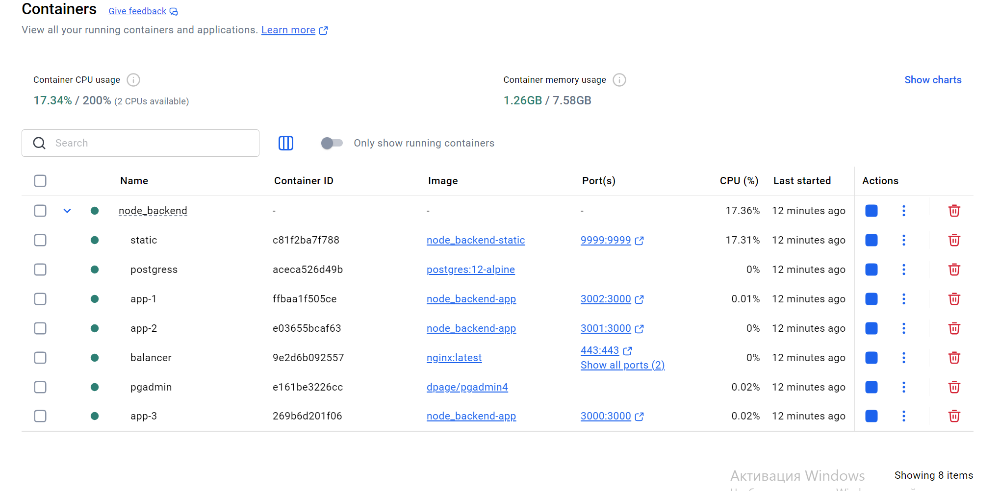

### Описание проекта

Шаблон проекта node/nestjs tapGus!!

### Общие требования

1. node >=22.9
2. nginx + image-filter
4. Docker 20
4. PostgreSql 12
5. Nest JS 11
6. Jest
7. Nodemon
8. TypeOrm
8. Npm
8. Pug

### Описание развертывания проекта


1. Установить [Docker](https://docs.docker.com/install/) и [Docker Compose](https://docs.docker.com/compose/install/).
1. Добавить доменное имя `localhost` и все поддомены из в `docker-compose.override.yml` ```/etc/hosts```
    ```
    127.0.0.1 localhost
    ```
1. Предотвратить возможные конфликты:
    - если работает локально установленный nginx или иной web-сервер, который может занимать порт 80 на локальном 
        сервере, остановить его или перенастроить;
    - если включены, остановить все другие docker-контейнеры от других проектов.
1. После выполнить
    ```
    docker-compose up -d
    ```
1. Нужно подождать когда развернётся весь node backend и react frontend т.к он входит в данную сборку контейнером static
   Результат должен быть таким:
   
   Опишу что здесь что:\
   static - React frontend контейнер с сервером React Jsx стартующий на порту 9999 \
   postgres - Бд postgres \
   app-1, app-2 ,app-3 - Инстансы бэкенда node js, nestJs \
   balancer - Балансировщик Nginx балансирующий запросы от static или любые другие входящие запросы на эти 3 бэкенда \
   pgadmin - Админ панель для бд postgres \
