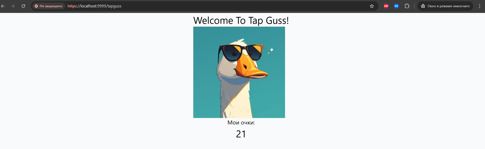
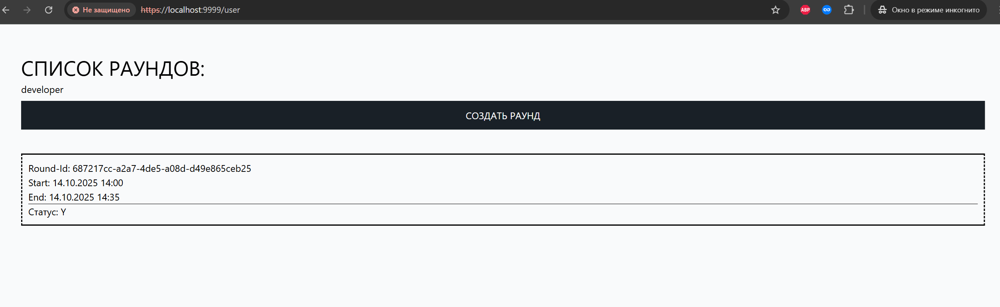

### Описание проекта

Шаблон проекта node/nestjs tapGus!!

### Общие требования

1. node >=22.9
2. nginx + image-filter
4. Docker 20
4. PostgreSql 12
5. Nest JS 11
6. Jest
7. Nodemon
8. TypeOrm
8. Npm
8. Pug

### Требования и скетчи

 ```
 https://github.com/round-squares/tech-task-for-interview/wiki
 ```

### Описание развертывания проекта


1. Установить [Docker](https://docs.docker.com/install/) и [Docker Compose](https://docs.docker.com/compose/install/).
1. Добавить доменное имя `localhost` и все поддомены из в `docker-compose.override.yml` ```/etc/hosts```
    ```
    127.0.0.1 localhost
    ```
1. Предотвратить возможные конфликты:
    - если работает локально установленный nginx или иной web-сервер, который может занимать порт 80 на локальном 
        сервере, остановить его или перенастроить;
    - если включены, остановить все другие docker-контейнеры от других проектов.
1. После выполнить
    ```
    docker-compose up -d
    ```
1. Нужно подождать когда развернётся весь node backend и react frontend т.к он входит в данную сборку контейнером static
   Результат должен быть таким:
   
   Опишу что здесь что:\
   static - React frontend контейнер с сервером React Jsx стартующий на порту 9999 \
   postgres - Бд postgres \
   app-1, app-2 ,app-3 - Инстансы бэкенда node js, nestJs \
   balancer - Балансировщик Nginx балансирующий запросы от static или любые другие входящие запросы на эти 3 бэкенда \
   pgadmin - Админ панель для бд postgres \
2. Перейти в контейнер frontend-react по адресу: https://localhost:9999 \
   Получить окно авторизации такого вида по первому скетчу:
   
3. Накатить seeds "заполнители фикстур" от node nest на бэке выполнить
    ```
    npm run seed
    ```
   
   Добавятся пользователи и раунды.
4. После авторизации стартует игра, и появляется наш "известный персонаж" Гусь! :) 4 скетч \
   
   Счетчик до начала игры видно внизу, после того как заканчивается можно тапать по Гусю! Игра началась! 3 скетч \
   
   Когда игра закончена игра блокируется тапы тоже
   
5. Идем по адресу /user/rounds или /user видим форму создания раундов, роль пользователя учитывается: 
   
   для обычных пользователей показывается только список их раундов без кнопки.
6. Так же есть страница статистики раунда по ссылке с раунда:
   
   На странице выводится статистика раунда скетч 5, не совсем жестко сделано соблюдая скетч, "пока что":
   Всего: - Информация о всего очков в раунде за всё время всеми пользователями
   Победитель: Информация о том кто победитель по очкам этого раунда "Имя" и его максимальные очки которые он онабрал в этом раунде им можешь быть и ты!
   Мои очки: Информация о очках текущего игрока
   Имя текущего игрока не справа, а снизу чуть чуть не по скетчу.
7. Бд должна получиться по таблицам такая:
   
8. Форма добавления раунда:
   
   Поля: \
   Активность раунда: Y,N,C  символьное значение \
   Имя раунда: Название раунда символьное значение \
   Идентификатор пользователя на кого назначаем: Идентификатор кто будет играть \
   Время начала раунда: Время начала раунда \
   Время конца раунда: Время конца раунда \
   Статус раунда: Y,N  символьное значение
   
   
   
